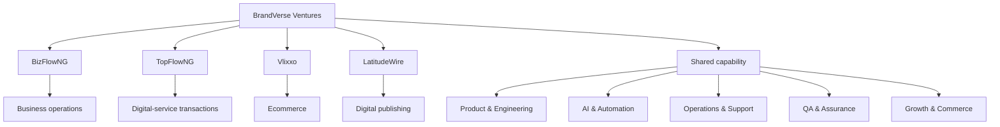

# BrandVerse Ecosystem Architecture

This is a deliberately high-level public view of how the BrandVerse ecosystem fits together. It describes product relationships and shared capability, not private production topology.

## Shared operating principles

The products are distinct customer experiences, but they share product thinking, engineering discipline, automation, release verification, monitoring and operational learning.

The ecosystem also includes private internal systems for CRM, projects, tasks, approvals, support, finance, people operations, recruitment, knowledge, analytics, AI/RAG, integrations, security, audit, social publishing, monitoring, backups and QA.

## Public/private boundary

The public repository describes capabilities and product relationships only. It does not document private network topology, internal hostnames, production credentials, environment values, customer data, privileged APIs, backup locations, security-sensitive runbooks or deployment secrets.
